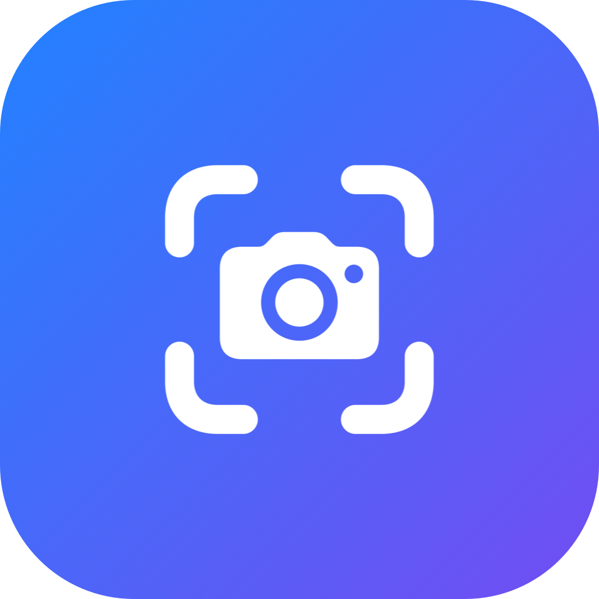

<div align="center">
  
  <h1>DevScreenshot</h1>
  <p><strong>Pixel-exact window screenshots for the Mac App Store — straight from your menu bar.</strong></p>
  <p>
    
    
    
  </p>
</div>

## Why

App Store Connect only accepts macOS screenshots at a few **exact pixel sizes** — `2560×1600`, `2880×1800`, `1440×900`, `1280×800` (all 16:10). Hitting those by hand is fiddly: a window screenshot on a Retina display is captured at 2× scale, window shadows add stray pixels, and most tools can't set a window to an exact size.

DevScreenshot does it for you. Pick a target size, pick an app — it resizes the app's front window to the matching **point** size (`target ÷ backing-scale`, e.g. `1280×800` pt → `2560×1600` px on a 2× display), captures exactly that rectangle, and trims to the last pixel so App Store Connect accepts it without complaint.

## Features

- 🎯 **Exact pixel output** — the four App Store presets, plus a custom `W×H`.
- 🪟 **Pick any app** — live list of running apps in the menu; captures the front window.
- 📐 **Retina-aware** — computes the point size from the display's backing scale automatically.
- ✂️ **No distortion** — pads or crops to the exact target only if an app enforces a minimum size.
- 📁 **Configurable save location** — defaults to `~/Desktop/DevScreenshot`.
- ⏱️ **Capture delay** — 0 / 2 / 5 s, e.g. to open a menu before the shot.
- 📋 **Copy to clipboard** and 🔔 **shutter sound** toggles.
- 🚀 **Launch at login** (via `SMAppService`).
- 🪶 **Menu-bar only** — no Dock icon, no window (`LSUIElement`).

## Install

```sh
git clone https://github.com/fr-Fabix/DevScreenshot.git
cd DevScreenshot
./build.sh
cp -R DevScreenshot.app ~/Applications/
open ~/Applications/DevScreenshot.app
```

> Build it yourself — the app is ad-hoc signed locally, which keeps the macOS permission grants stable across relaunches. Run it from `~/Applications` (a stable path), not from a synced folder.

## First run — permissions

DevScreenshot needs two one-time permissions (**System Settings → Privacy & Security**):

1. **Accessibility** — to resize the target window. Requested on your first capture.
2. **Screen Recording** — for the capture itself. After enabling it, **quit and relaunch** the app (a macOS requirement).

## Usage

Click the camera icon in the menu bar:

1. Choose a **target size** (or *Custom…*).
2. Choose an **app** under *Capture window*.
3. The shot is saved to your folder; optionally copied to the clipboard / revealed in Finder.

Capturing a specific window? Bring it to the front of its app first — DevScreenshot uses the front (main) window.

## How it works

```
point size = target pixels ÷ display backing scale     # 2560×1600 px → 1280×800 pt @2x
screencapture -R x,y,w,h                                # capture the exact window rect (no shadow, no alpha)
sips -p / -c                                            # pad or crop to the exact target as a safety net
```

Because the window rect is captured directly (not the `-l` window mode), there's no drop shadow and no alpha channel — both of which App Store Connect rejects.

## Build

```sh
./build.sh        # generates the icon, compiles main.swift, bundles DevScreenshot.app
```

No Xcode project required — just the Command Line Tools (`swiftc`, `iconutil`, `sips`). Edit the `PRESET_SIZES` line in [`main.swift`](main.swift) to change the presets, or [`make-icon.swift`](make-icon.swift) to restyle the icon.

## Ideas / roadmap

- Global hotkey to re-capture the last app
- Per-window picker when an app has multiple windows
- "Capture all sizes" in one click
- Optional device frame / background canvas for marketing shots
- Multi-display backing-scale handling
- Notarized release + DMG

Contributions welcome.

## License

[MIT](LICENSE) © fr-Fabix
